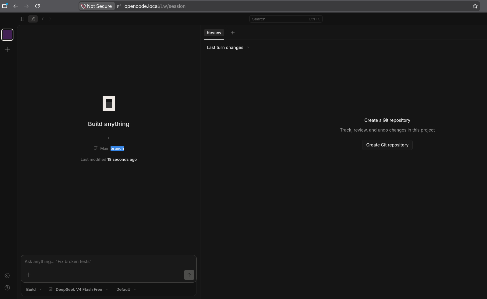

# OpenCode for YunoHost

[](https://dash.yunohost.org/appci/app/opencode)  

*[Lire ce readme en français.](./README_fr.md)*

> *This package allows you to install OpenCode quickly and simply on a YunoHost server.
If you don't have YunoHost, please consult [the guide](https://doc.yunohost.org/admin/get_started/install_on/) to learn how to install it.*

## Overview

OpenCode is an open source AI coding agent that provides a powerful AI-assisted coding experience through your browser. It runs as a web application, making it accessible from any device on your network.

**Shipped version:** 1.17.9~ynh1

## Screenshots



## Disclaimers / important information

* OpenCode requires a dedicated domain (sub-path installation is experimental)
* The web interface is protected by YunoHost's SSO/ldap authentication
* OpenCode stores its configuration in the data directory
* No database is required to run this application

## Documentation and resources

* Official website: <https://opencode.ai>
* Official documentation: <https://opencode.ai/docs>
* Upstream code repository: <https://github.com/anomalyco/opencode>
* YunoHost documentation for this app: <https://yunohost.org/app_example>
* Report a bug: <https://github.com/YunoHost-Apps/opencode_ynh/issues>

## Developer info

Please send your pull request to the [testing branch](https://github.com/YunoHost-Apps/opencode_ynh/tree/testing).

To try the testing branch, please proceed like that.

``` bash
sudo yunohost app install https://github.com/YunoHost-Apps/opencode_ynh/tree/testing --debug
or
sudo yunohost app upgrade opencode -u https://github.com/YunoHost-Apps/opencode_ynh/tree/testing --debug
```

**More info regarding app packaging:** <https://doc.yunohost.org/dev/packaging/>
